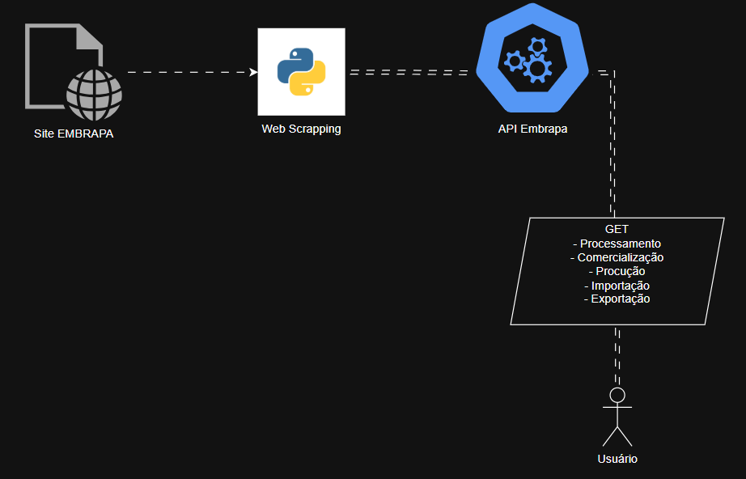

# 📊 tech-challenge-api-embrapa-g215

Projeto Tech Challenge - Fase 1 - Engenharia de Machine Learning  
Consumo de Dados da Embrapa via API

## 🌐 Deploy URL
**[Tech Challenge Api Embrapa - G215](https://tech-challenge-api-embrapa-g215.onrender.com/)**

---

## 🚀 Descrição

Esta API foi desenvolvida para facilitar o acesso a dados públicos da [EMBRAPA's Vitibrasil portal](http://vitibrasil.cnpuv.embrapa.br/download/) relacionados à produção, processamento, comercialização, importação e exportação de uvas no Brasil. Utiliza FastAPI para expor endpoints RESTful e realiza scraping dos dados diretamente do site da Embrapa.

---

## ⚙️ Arquitetura


## 🛠️ Como executar

1. **Clone o repositório:**
```sh
git clone https://github.com/seu-usuario/

tech-challenge-api-embrapa-g215.git

cd tech-challenge-api-embrapa-g215
```

2. **Crie e ative um ambiente virtual (opcional, mas recomendado):**
```sh
python -m venv .venv
.venv\Scripts\activate
```

3. **Instale as dependências:**
```sh
pip install -r requirements.txt
```
4. **Execute a API:**
```sh
uvicorn main:app --reload
```

5. **Acesse a documentação interativa:**
```
- http://localhost:8000/docs (Swagger UI)
```
---

## 📡 Endpoints Principais

### Boas-vindas

- GET /
  Exibe uma mensagem de boas-vindas.

---

### Processamento

- GET /processamento/{ano}/{subcategoria}
  Retorna dados de processamento para o ano e subcategoria informados.

---

### Comercialização

- GET /comercializacao/{ano}
  Retorna dados de comercialização para o ano informado.

---

### Produção

- GET /producao/{ano}/{subcategoria}
  Retorna dados de produção para o ano e subcategoria informados.

---

### Importação

- GET /importacao/{ano}/{subcategoria}
  Retorna dados de importação para o ano e subcategoria informados.

---

### Exportação

- GET /exportacao/{ano}/{subcategoria}
  Retorna dados de exportação para o ano e subcategoria informados.

---

### Observações

- Os endpoints /processamento, /processamento/{ano}, /exportacao, /exportacao/{ano}, etc., existem apenas para orientar o usuário sobre o uso correto das rotas e retornam mensagens de erro amigáveis.
- Consulte a documentação interativa para ver exemplos de parâmetros válidos para cada rota.
- Em caso de erro de scraping (por exemplo, se o site da Embrapa estiver fora do ar), a API retorna um erro HTTP 500 com uma mensagem explicativa.

---

## 🧰 Tech Stack
- Python 3.11+  
- FastAPI
- httpx
- BeautifulSoup4  
- Pandas

---

## 👨‍💻 Desenvolvedores
- Vinnicius Toth - vinni.toth@gmail.com
- G215 Team – FIAP Tech Challenge 1